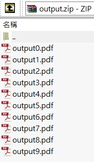

# iTextSharpLGPLv2.Templater  

This is a pdf field template library that focuses on filling in form fields like text, radio button, checkbox, image, barcode and watermark.  

This library was developed to solve the problem that customers often need to change pdf templates. Use this library to quickly change pdf templates without changing the code every time.  

---  

### License  

[GNU LIBRARY GENERAL PUBLIC LICENSE (LGPL V2.0)](https://www.gnu.org/licenses/old-licenses/lgpl-2.0-standalone.html)  

This library uses [iTextSharp.LGPLv2](https://github.com/VahidN/iTextSharp.LGPLv2.Core) internally to generate pdf files, so its license is more permissive than iTextSharp 5 and iText 7.  

* iTextSharp.LGPLv2 -> (LGPL v2.0)  
* iTextSharp 5 or iText 7 -> (AGPL)  

---  

### Nuget install  

```
PM> Install-Package iTextSharpLGPLv2.Templater
```  

---  

### Pdf template  

The template can be created in Word first, then exported to pdf, and then use Adobe Acrobat to add the form fields where the data needs to be filled in.  

  

---  

### Example  

Set the `template path` and `font path` in the page.  

```C#
var fontPaths = new List<string>
{
    Path.Combine(_projectPath, @"Fonts\arial.ttf"),
    Path.Combine(_projectPath, @"Fonts\cwTeXHei-zhonly.ttf")
};
var template1 = Path.Combine(_projectPath, @"Templates\demo1.pdf");
var template2 = Path.Combine(_projectPath, @"Templates\demo2.pdf");

var templater = new PdfTemplater
{
    Pages = new List<TemplatePage>
    {
        new TemplatePage(fontPaths)
        {
            FilePath = template1,
            Items = new List<TemplateItem>
            {
                ...
            }
        },
        new TemplatePage(fontPaths)
        {
            FilePath = template2,
            Items = new List<TemplateItem>
            {
                ...
            }
        },
    }
};
```

> **Warning**  
> arial.ttf is not available for commercial use.  

Set `template item` in the page.  

```C#
Items = new List<TemplateItem>
{
    // text
    new TextItem("Text", "Text"),
    // text with color and textSize
    new TextItem("TextColor", "TextColor",
        color: System.Drawing.Color.FromArgb(255, 106, 0),
        textSize: 12f),
    // radio button
    new RadioButtonItem("RadioButton", "Yes"),
    // check box
    new CheckBoxItem("CheckBox2", "Yes"),
    // image
    new ImageItem("Image", imagePath),
    // barcode
    new BarcodeItem("Barcode", "123456789"),
    // watermark
    new WaterMarkField("Text", "WaterMark",
        fontPaths[0], 130f, 0.3f, 30f, -40f, 45),
    // paragraph
    new ParagraphItem("Paragraph", (baseFonts) =>
    {
        var selector1 = new FontSelector();
        foreach(var baseFont in baseFonts)
            selector1.AddFont(new Font(baseFont, 15f, Font.NORMAL));

        var selector2 = new FontSelector();
        foreach(var baseFont in baseFonts)
            selector2.AddFont(new Font(baseFont, 15f, 
                Font.STRIKETHRU | Font.BOLD));
            
        var paragraph = new Paragraph();
        paragraph.Add(selector1.Process("abc "));
        paragraph.Add(selector2.Process("中文測試"));
        paragraph.Leading = 13;
        return paragraph;
    }),
}
```


Call `ToPdf()` method to output the template to stream.  

```C#
using (var fs = new FileStream(output,
    FileMode.Create, FileAccess.ReadWrite))
{
        templater.ToPdf(fs);
}
```

---  

### Demo  

  

---  

### Item - Component  

Component type used by the item.  

 Item | Component 
-------|----------
 TextItem | Text 
 RadioButtonItem | RadioButton
 CheckBoxItem | CheckBox
 ImageItem | Button
 BarcodeItem | Text 
 WaterMarkItem | Text 
 ParagraphItem | Text 

---  

For example, `TextItem` needs to use the `text component` in the pdf.  

  

And the first parameter `key` needs to use the `name` attribute.  

```C#
new TextItem(key, value)
```

  

`RadioButtonItem` and `CheckBoxItem` require additional setting of the selected value.  

  

`ImageItem` needs to use `button component`.  

  

`WaterMarkItem` can use any field as positioning.  

```C#
new WaterMarkField("Text", ...)
```

---  

### Use on zip  

```C#
var output = Path.Combine(_projectPath, @"output.zip");

using (var fs = new FileStream(output,
    FileMode.Create, FileAccess.ReadWrite))
{
    using (var archive = new ZipArchive(
        new ZipWrapStream(fs), ZipArchiveMode.Create))
    {
        for (var i = 0; i < 10; i++)
        {
            var zipEntry = archive.CreateEntry(
                $"output{i}.pdf", CompressionLevel.Fastest);
            using (var zipStream = zipEntry.Open())
            {
                templater().ToPdf(zipStream);
            }
        }
    }
}
```

  

---  

### Use on web  

